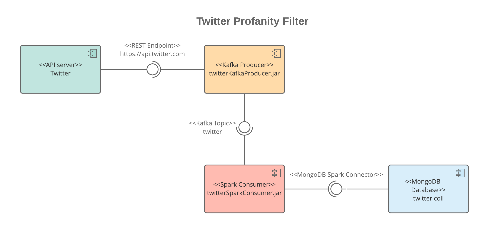

<br/>
<br/>
<br/>
<br/>
<br/>


<p style="text-align:center"></p>

<br/>
<br/>
<br/>
<br/>

# Twitter Profanity Filter
## Big Data Models and Algorithms, University of L'Aquila.  
### Stefano Valentini - m. 254825

<br/>
<br/>
<br/>
<br/>
<br/>
<br/>
<br/>
<br/>
<br/>
<br/>
<br/>
<br/>
<br/>
<br/>
<br/>
<br/>

demo: [https://youtu.be/TvMuIvu6a5E](https://youtu.be/TvMuIvu6a5E)

<div style="page-break-after: always;"></div>

[//]: # (================================= TOC ================================================)

# Table of Contents
1. [Introduction](#introduction)
   
2. [Architecture](#architecture)  
    2.1. [Kafka Producer](#kafka-producer)  
    2.2. [Spark Consumer](#adopted-technologies-rest-server)  

3. [Conclusions](#conclusions)

    
<div style="page-break-after: always;"></div>

[//]: # (================================= INTRODUCTION ================================================)

# Introduction <a name="introduction"></a>

The goal of this project is to build an application that is capable of retrieving the twitter's tweet streaming, apply a filter, and store on a MongoDb database only the tweets that are written in english and do not contain a series of banned words (in this case the [Google's profanity words list](https://www.freewebheaders.com/full-list-of-bad-words-banned-by-google/)).

<div style="page-break-after: always;"></div>

[//]: # (================================= ARCHITECTURE ================================================)

# Architecture <a name="architecture"></a>

<p style="text-align:center"></p>

In a nutshell: the tweet's stream is retrieved by the Kafka Producer using the <code>twitter4j</code> library, that offers ready-to-use functions to interact with the Twitter's API Server.  
For each tweet, the Kafka Producer asynchronously publishes a record to the <code>twitter</code> topic; since the Spark Consumer is subscribed to this topic it will receive each tweet; it will then apply the specified filter and it will save the received records to the MongoDB database in batches, each X milliseconds (where X is configurable inside the properies file).

[//]: # (================================= KAFKA PRODUCER ================================================)


<br/>


## Kafka Producer <a name="kafka-producer"></a>

The Kafka Producer is responsible for retrieving the tweet stream and to publish the received tweets to the <code>twitter</code> topic.  
The tweet json structure can be found in the <code>twitter-kafka-producer/src/main/resources/tweet.json</code> file; for this project we are only interested in the <code>lang</code> and <code>text</code> fields but, since we want the producer to be independent w.r.t. the application's goal, we will publish the whole json anyway.  
The <code>twitter4j</code> library works by connecting to the Twitter API endpoint and by instantiating a <code>Listener</code> object, whose methods will be invoked according to the responses that are received from Twitter; in particular we are interested in the <code>onStatus</code> method, that will be called when a new status is received.
The <code>onStatus</code> invokes the publish procedure, that is responsible of building the Kafka record and to publish it to the <code>twitter</code> topic.

<div style="page-break-after: always;"></div>

## Spark Consumer <a name="spark-consumer"></a>

The Spark Consumer is responsible for fetching the tweets from the <code>twitter</code> topic, apply a filter to the stream, and save the results to a MongoDB database.
It is initialized by instantiating a <code>SparkSession</code> object, to be used to create the input <code>Dataset</code> object.  
The input dataset is constructed by specifiyng that the rows are in the <code>kafka</code> format, and that they have to be retrieved from the address specified in the properies file and from the <code>twitter</code> topic. 
```java
Dataset<Row> inputDf = sparkSession
    .readStream()
    .format("kafka")
    .option("kafka.bootstrap.servers", KafkaConfiguration.get("address"))
    .option("subscribe", KafkaConfiguration.get("topic"))
    .load();
```
Since that <code>value</code> field of the kafka record is not readable by Spark we need to cast it to <code>string</code>; now that we have a readable value we need to structurize it so to be able to query and filter it by accessing its fields.
By starting from a <code>twitter.json</code> model file we can extract its schema by importing this single file into a dummy Spark dataset; this operation is performed only once, at the start of the execution.
Now that we have a string value and a schema we can adapt that string value to the schema we built, so to construct a structurized dataset.  
Having a dataset whose rows are structured allows us to access its fields by using the field names themselves so we can finally apply the filter:  
```java
Dataset<Row> filteredDf = inputDfAsJsonFlattened
    .filter(inputDfAsJsonFlattened.col("lang").equalTo("en")
        .and(not(inputDfAsJsonFlattened.col("text")
                .rlike("(^|\\s)("+String.join("|", bannedWords)+")(\\s|$)"))));

```
The code above builds a new dataset by filtering the input one: first we check that the <code>lang</code> field is equal to <code>en</code>, then we check that the <code>text</code> field (that contains the text body of the tweet) does not contain any of the words loaded from the <code>banned-words.txt</code> configuration file (through the <code>FilterConfiguration</code> class).  

The filtered dataset is then prepared to be inserted into the database; with the code below we are commanding that every <code>processingTime</code> milliseconds each row of the dataset that has still not be processed (<code>append</code>) must be sent to the database sink (<code>MongoDbSink</code>).  
<div style="page-break-after: always;"></div>

```java
StreamingQuery databaseOutput = filteredDf.writeStream()
    .outputMode("append")
    .trigger(Trigger.ProcessingTime(processingTime, TimeUnit.MILLISECONDS))
    .foreach(new MongoDbSink())
    .start();

databaseOutput.awaitTermination();
```

A sink in Spark is a class that performs some kind of processing on the input dataset (sink, meaning that everything is thrown there); in our case our sink extends the spark's <code>ForeachWriter</code> class by implementing its methods: <code>open</code>, <code>process</code>, <code>close</code>.

- In the <code>open</code> method, that is invoked each time a batch is processed (i.e., every <code>processingTime</code> milliseconds), we initialize the connection to the database and we instantiate a list that will contain all the rows that will be then saved. 
   
- In the <code>process</code> method, that is executed after the <code>open</code>, we simply add the current row to the previously declared list.  
  
- In the <code>close</code> method, that is executed after the last row has been processed, we create a MongoDB document for each value in the list that we built, using as id the <code>id_str</code> field of the tweet and the <code>text</code> field as value.


<div style="page-break-after: always;"></div>

[//]: # (================================= CONCLUSIONS ================================================)

# Conclusions <a name="conclusions"></a>

By looking at the database we can see that we have about <b>50 insertion per second</b> and this seems right because:
- we know that [there are obout 5800 tweets/s](https://www.omnicoreagency.com/twitter-statistics/)
- we are only looking at tweets in english by using the <code>lang</code> property that is inferred by the Twitter's algorithms (so, alot of tweets may have this property as not defined or are wrongly categorized)
- we are filtering a list of 1703 common "bad" words (like "ugly", for example)   

